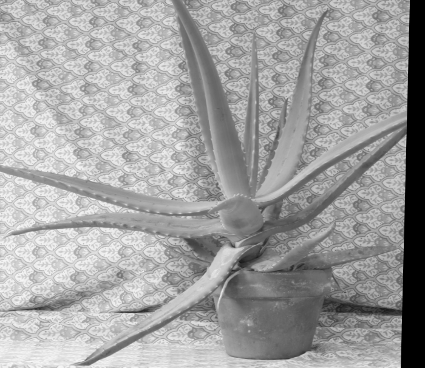
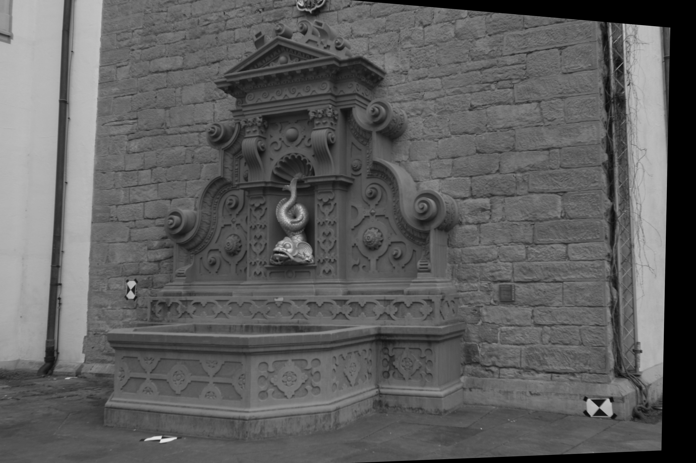
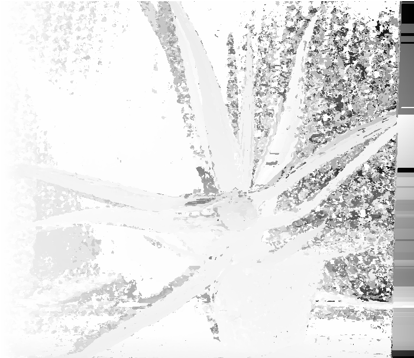

# TIPE (2022) — Reconstruction de profondeur par stereo vision

> Dépôt d'archive : code d'un TIPE de classe préparatoire (2022), publié tel quel à titre de
> référence. Non maintenu activement.

TIPE (Travail d'Initiative Personnelle Encadrée) sur la vision par ordinateur : comment
reconstruire l'information de profondeur d'une scène à partir de deux photographies prises sous
des angles différents (vision stéréoscopique), en s'appuyant sur la géométrie épipolaire.

Notions mobilisées : géométrie épipolaire, algorithme à 8 points, décomposition en valeurs
singulières (SVD), RANSAC, rectification d'images, block matching.

## Pipeline

1. **Détection et appariement de points d'intérêt** (SIFT + FLANN) entre les deux images.
2. **Estimation de la matrice fondamentale** `F`, avec une implémentation maison de l'algorithme à
   8 points (par SVD), robustifiée par un RANSAC artisanal (2000 tirages de 8 points, conservation
   du tirage avec le plus d'inliers), comparée à `cv2.findFundamentalMat` d'OpenCV.
3. **Vérification visuelle** par tracé des lignes épipolaires.
4. **Rectification** des deux images (homographies via `cv2.stereoRectifyUncalibrated`) pour que
   les lignes épipolaires deviennent horizontales.
5. **Carte de disparité** par block matching maison (SAD, fenêtre glissante autour de chaque
   pixel), avec une version parallélisée sur plusieurs threads, comparée à `cv2.StereoBM`.
6. **Carte de profondeur** : formule `profondeur = baseline * focale / disparité`
   (`src/depth.py`) — nécessite de connaître la ligne de base et la focale des caméras, non
   calibrées pour le jeu de données fourni ici, donc non appliquée par défaut dans `main.py`.

## Installation

```
pip install -r requirements.txt
```

## Usage

```
python3 main.py
```

Lit `data/left.jpg` et `data/right.jpg`, écrit les résultats dans `outputs/` (non versionné,
régénéré à chaque exécution).

Calibrage manuel optionnel (sélection à la souris de points correspondants, en alternative à la
détection automatique SIFT) :

```
python3 -m src.manual_calibration
```

## Structure du dépôt

```
main.py                    pipeline complet, du chargement des images à la carte de disparité
src/
  fundamental_matrix.py     algorithme à 8 points + RANSAC maison
  rectification.py          détection SIFT/FLANN, rectification, tracé des lignes épipolaires
  disparity.py               carte de disparité par block matching (mono-thread et multi-thread)
  depth.py                    conversion disparité -> profondeur
  manual_calibration.py       outil interactif de calibrage manuel (optionnel)
data/                       paire d'images stéréo d'entrée
results/                    exemples de résultats (figés, pour ce README)
```

## Résultats

Sur la paire `data/left.jpg` / `data/right.jpg` (606×700) : 3890 points appariés par SIFT+FLANN,
dont 3081 conservés comme inliers par le RANSAC maison (2000 tirages de 8 points). Les matrices
fondamentales obtenues par l'implémentation maison et par `cv2.findFundamentalMat`, normalisées
par leur plus grand coefficient, coïncident :

```
F (maison)           F (OpenCV)
 0   0  0              0   0  0
 0   0 -1              0   0 -1
 0   1  0              0   1  0
```

Cette forme quasi antisymétrique (un seul coefficient significatif hors diagonale) est cohérente
avec une paire d'images liées par une translation caméra essentiellement horizontale.

Lignes épipolaires (matrice fondamentale calculée à la main) :


Paire d'images après rectification (les lignes épipolaires deviennent horizontales) :




Carte de disparité obtenue par block matching :


