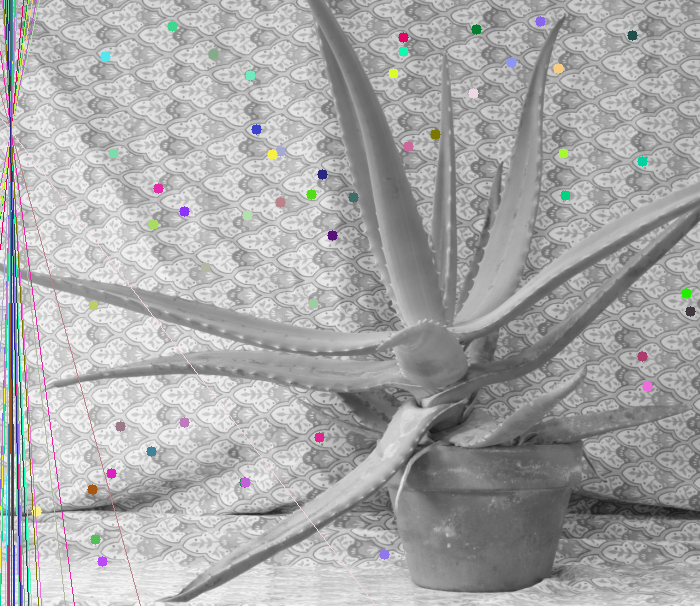
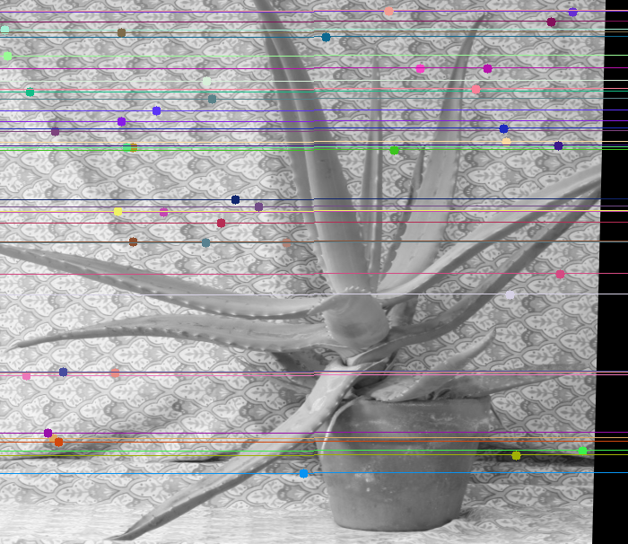
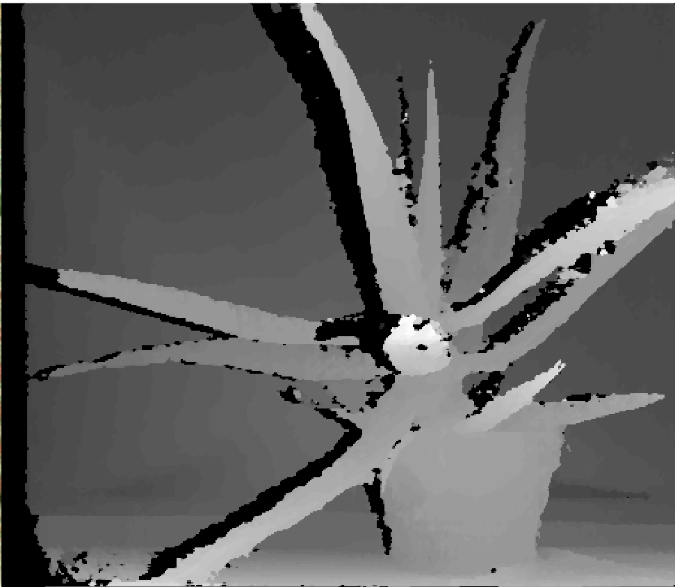
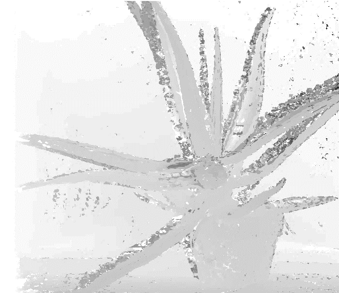

# TIPE (2022) — Reconstruction de profondeur par stereo vision

> Dépôt d'archive : code d'un TIPE de classe préparatoire (2022), publié tel quel à titre de
> référence. Non maintenu activement.

Problématique du TIPE : *comment mettre en place un système d'arbitrage vidéo, en s'inspirant de
la technologie Hawk-Eye (tennis, depuis 2006 : calibration multi-caméras, détection de la balle,
triangulation, prédiction de trajectoire), grâce à la géométrie épipolaire ?* Ce dépôt implémente
la brique de base de ce type de système : reconstruire l'information de profondeur d'une scène à
partir d'une seule paire d'images stéréo.

## I. Géométrie épipolaire

Pour deux caméras observant la même scène, un point 3D `X` se projette en `x1` et `x2` sur les
deux images. Ces projections sont liées par la **matrice fondamentale** `F` (3×3, rang 2) :

```
x2ᵀ · F · x1 = 0
```

`F` encode la géométrie relative des deux caméras (position, orientation) sans connaître leur
calibration interne. Elle permet de tracer, pour chaque point d'une image, sa **ligne
épipolaire** dans l'autre — la droite sur laquelle doit se trouver son point correspondant.

## II. Algorithme à 8 points (calibration)

1. Détection et appariement de points d'intérêt entre les deux images (SIFT + FLANN).
2. Estimation de `F` à partir de 8 correspondances par l'**algorithme à 8 points**
   (Longuet-Higgins, 1981) : résolution du système linéaire `x2ᵀ F x1 = 0` par SVD, puis
   projection sur l'espace des matrices de rang 2.
3. Robustification par un **RANSAC** artisanal (2000 tirages de 8 points au hasard, conservation
   du tirage produisant le plus d'inliers, seuil d'erreur `|x2ᵀ F x1| < 0.001`).

Comparé systématiquement à `cv2.findFundamentalMat`.

## III. Carte de disparité

- **Disparité** : décalage apparent d'un même point entre les deux images.
- **Carte de disparité** : image où chaque pixel vaut sa disparité.
- **Carte de profondeur** : `profondeur = baseline × focale / disparité` (`src/depth.py`) —
  nécessite de connaître la ligne de base et la focale des caméras, non calibrées pour le jeu de
  données fourni ici, donc non appliquée par défaut dans `main.py`.

Avant de calculer une carte de disparité par recherche de correspondances ligne par ligne, les
deux images sont **rectifiées** (homographies via `cv2.stereoRectifyUncalibrated`) pour que leurs
lignes épipolaires deviennent horizontales. La disparité est ensuite estimée par **block
matching** maison (somme des différences absolues sur une fenêtre glissante autour de chaque
pixel), avec une version parallélisée sur plusieurs threads, comparée à `cv2.StereoBM`.

## IV. Résultats et comparaisons

Sur la paire `data/left.jpg` / `data/right.jpg` (606×700) : 3890 points appariés par SIFT+FLANN,
dont 3081 conservés comme inliers par le RANSAC maison. Les matrices fondamentales obtenues par
l'implémentation maison et par `cv2.findFundamentalMat`, normalisées par leur plus grand
coefficient, coïncident :

```
F (maison)           F (OpenCV)
 0   0  0              0   0  0
 0   0 -1              0   0 -1
 0   1  0              0   1  0
```

Cette forme quasi antisymétrique (un seul coefficient significatif hors diagonale) est cohérente
avec une paire d'images liées par une translation caméra essentiellement horizontale.

Lignes épipolaires avant rectification (elles convergent vers l'épipole) et après rectification
(elles deviennent horizontales, ce qui valide la rectification) :




Paire d'images rectifiées :


Carte de disparité : implémentation maison (SAD) contre `cv2.StereoBM`. L'implémentation maison
retrouve la silhouette de la plante mais reste bruitée et peu contrastée ; `StereoBM` (filtrage et
gestion des occlusions plus avancés) donne une carte nettement plus propre. La troisième image est
la meilleure version obtenue à l'époque, présentée dans le support de TIPE :





## Installation

```
pip install -r requirements.txt
```

## Usage

```
python3 main.py
```

Lit `data/left.jpg` et `data/right.jpg`, écrit les résultats dans `outputs/` (non versionné,
régénéré à chaque exécution).

Calibrage manuel optionnel (sélection à la souris de points correspondants, en alternative à la
détection automatique SIFT) :

```
python3 -m src.manual_calibration
```

## Structure du dépôt

```
main.py                    pipeline complet, du chargement des images à la carte de disparité
src/
  fundamental_matrix.py     algorithme à 8 points + RANSAC maison
  rectification.py          détection SIFT/FLANN, rectification, tracé des lignes épipolaires
  disparity.py               carte de disparité par block matching (mono-thread et multi-thread)
  depth.py                    conversion disparité -> profondeur
  manual_calibration.py       outil interactif de calibrage manuel (optionnel)
data/                       paire d'images stéréo d'entrée
results/                    exemples de résultats (figés, pour ce README)
```
